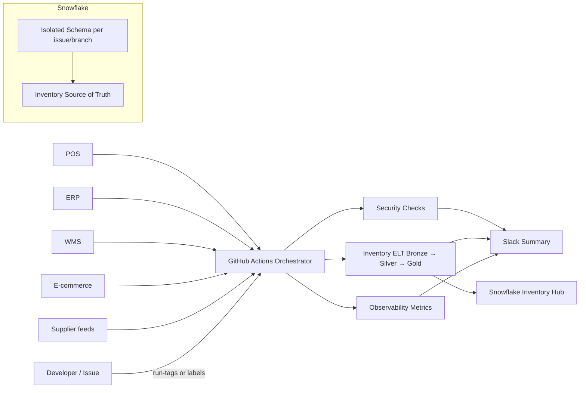
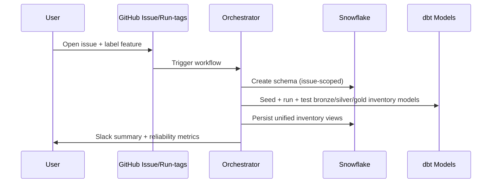

# Real-Time Inventory Visibility — DataOps Sandbox

This repo showcases how a DataOps team can deliver **cross-channel, real-time inventory visibility** with Snowflake, dbt, and GitHub Actions. The orchestrator provisions isolated schemas on demand, runs batch + streaming-friendly ELT, and publishes reliability signals so stale stock is caught before it reaches customer-facing channels.

## Context & intent
- **What this shows**: A reference Delivery+Ops blueprint for keeping inventory accurate across POS, ERP, WMS, e-commerce, and supplier feeds using Snowflake + dbt + GitHub Actions.
- **Problem**: Stock levels drift when feeds are late, missing, or inconsistent (SKUs, locations, timestamps). That causes oversells, stockouts, and bad customer experiences.
- **Approach**: Automate ingestion and medallion modeling with isolated, per-issue schemas; enforce security/quality gates; surface observability so freshness/volume issues are caught early; ship Slack summaries for humans-in-the-loop.
- **Outcome**: A reproducible kit to onboard new feeds/channels quickly, with guardrails to keep inventory truth current and auditable.

## Use case: Real-time inventory across all channels
- Automate ingestion of POS, ERP, WMS, e-commerce cart, and supplier feed data (batch + streaming-ready patterns).
- Normalize SKUs, locations, timestamps, and stock metrics into a single source of truth.
- Monitor pipeline reliability so missing or late feeds trigger alerts before APIs/dashboards drift.
- DataOps owns the guardrails: secrets, environment isolation, run-tags, and cleanup paths.

## Value
- Accurate stock levels in real time across warehouses, stores, and digital channels.
- Fewer stockouts/oversells and faster rollback when a source misbehaves.
- Faster onboarding of new suppliers or channels via templated feature/cleanup workflows.

## What this lab teaches (DataOps patterns)
- **Environment isolation**: Each feature/issue gets its own Snowflake schema; `main`/`develop` map to prod/dev.
- **Declarative orchestration**: Security → ELT → Observability with opt-in run-tags and issue labels.
- **Inventory medallion models**: dbt bronze (raw feeds), silver (SKU/location/timestamp conformance), gold (availability KPIs).
- **Observability by default**: Freshness/volume/duration metrics are collected and summarized.
- **Shift-left governance**: Security checks, secret scanning, and policy configs live in CI.

## Tooling and why it is here
- **GitHub Actions**: Orchestrates Security → ELT → Observability with opt-in triggers, outputs, and Slack hooks.
- **Snowflake**: Central inventory hub; each run gets an isolated schema to avoid collisions and speed cleanup.
- **dbt**: Implements medallion models and tests for SKUs/locations/stock metrics; profiles live in-repo.
- **Python utilities**: Seed generators, schema create/drop, and metrics runners used by the workflows.
- **Slack webhooks**: Human-friendly summaries for stage outcomes and reliability signals.
- **YAML/policy configs**: `.sqlfluff`, `.yamllint.yml`, `.pre-commit-config.yaml` enforce standards locally and in CI.

## System view


### Pipeline lifecycle (issue-driven)


## Repository layout
- `.github/workflows`: Orchestrator and stage workflows (security, ELT, observability).
- `scripts/dbt`: dbt project with bronze/silver/gold inventory models, seeds, macros, and profiles.
- `scripts/python`: Utilities for seeding, cleanup, and metrics.
- `scripts/sql`: SQL assets (metrics query, utility SQL).

## Requirements
- Snowflake account.
- GitHub repo with Actions enabled.
- Secrets configured:
  - `SNOWFLAKE_ACCOUNT`, `SNOWFLAKE_USER`, `SNOWFLAKE_PASSWORD`, `SNOWFLAKE_ROLE`, `SNOWFLAKE_WAREHOUSE`, `SNOWFLAKE_DATABASE`
  - `OBSERVABILITY_SCHEMA_PREFIX`
  - `SLACK_WEBHOOK_URL` (optional)

## Setup
1) Clone the repo.
2) Set the secrets above in GitHub → Settings → Secrets and variables → Actions.
3) (Optional) Local: `python -m venv .venv && source .venv/bin/activate && pip install -r scripts/python/elt.req.txt`.

## How orchestration triggers work
- **Issue label** `feature` → provision isolated schema and run pipelines (great for new supplier/channel onboarding).
- **Issue label** `cleanup` → drop isolated schema when a feed is deprecated.
- **Run-tags in commits**: `#orchestrate`, `#run_elt`, `#run_security`, `#run_obs`, or `#run_all` opt-in to pipeline stages.
- **No run-tags** → quiet by default (no pipeline).

## ELT model structure (dbt)
- **Bronze**: Raw POS/ERP/WMS/e-commerce/supplier feeds (batch or micro-batch).
- **Silver**: Conformance of SKUs/locations/timezones/stock metrics and standard naming.
- **Gold**: Availability KPIs (on-hand, available-to-promise, safety stock drift) for APIs/dashboards.
- **Monitoring**: Observability models for INFORMATION_SCHEMA metrics.
- Dynamic schema names via env (`DBT_TARGET_SCHEMA`) keep environments isolated.

## Observability
- `scripts/sql/sql_metrics.sql` surfaces freshness, row volume, failures, and duration per environment.
- `scripts/python/run_metrics.py` executes metrics against Snowflake and exports step outputs.
- Slack summaries report reliability and stage outcomes when `SLACK_WEBHOOK_URL` is set.

## Security & governance
- Pre-commit hooks: formatting, linting, secret scanning.
- GitHub Actions security workflow runs SAST/lint gates before ELT.
- Configuration files (`.sqlfluff`, `.yamllint.yml`, `.pre-commit-config.yaml`) enforce standards.
- **Expected outputs**:
  - Security job (`SQLFluff SAST`) uploads SARIF and annotates PRs; fails fast on SQL lint/quality issues.
  - ELT jobs emit dbt run/test results per layer; failures block downstream stages.
  - Observability job emits metrics (freshness, volume, failures, duration) and posts Slack summary when configured.
  - Orchestrator always emits a Slack summary with stage results and run URL when `SLACK_WEBHOOK_URL` is set.

### Install pre-commit locally (recommended)
```bash
python -m venv .venv && source .venv/bin/activate
pip install pre-commit
pre-commit install
pre-commit run --all-files
```

## Quick start (demo)
### From `main`, create and validate a new inventory feed
```bash
# 1) Start from main
git checkout main
git pull

# 2) Create a feature branch (optional local path)
git checkout -b feature/inventory-visibility

# 3) Push a small change with run-tags to exercise the platform
echo "# inventory demo touch" >> demo.txt
git add demo.txt
git commit -m "Demo inventory run #orchestrate #run_elt #run_obs"
git push -u origin feature/inventory-visibility
```

Expected demo outputs:
- Security job runs SQLFluff SAST on changed SQL; passes if clean.
- ELT jobs seed and run bronze/silver/gold models; dbt test results surface in logs.
- Observability job reports metrics and posts Slack summary (if webhook set); orchestrator summary shows stage outcomes and run URL.

### Drive the issue-driven workflow (onboard a new feed)
```bash
# From your browser or gh CLI, open an issue labeled `feature`
# Using GitHub CLI:
gh issue create \
  --title "Feature – onboard new supplier feed" \
  --label feature \
  --body $'Schema/Object Name: inv_supplier_stage\nUse case: Normalize supplier stock feed and stitch to WMS/POS inventory.'
```

After the issue is labeled `feature`, the orchestrator will:
- Create an isolated schema `inv_supplier_stage_issue_<issue_id>` in Snowflake.
- Seed data, run dbt models/tests (Bronze→Silver→Gold), and collect observability metrics.
- Post a Slack summary (if `SLACK_WEBHOOK_URL` is set).

## Troubleshooting
- Missing secrets → workflows fail fast with explicit errors.
- No pipeline run on push → ensure a run-tag is present.
- Snowflake auth errors → confirm `SNOWFLAKE_*` secrets match target account/role/warehouse/db.
