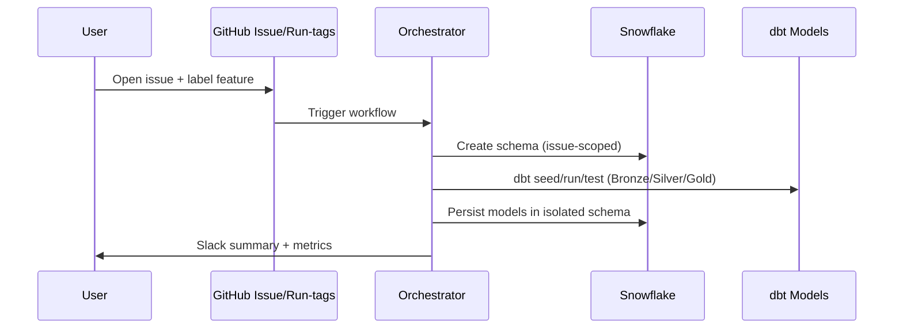

# Intelligent Inventory Management — DataOps Sandbox

Hands-on DataOps lab showing how to deliver Snowflake analytics with GitHub Actions, dbt, and strong delivery/observability controls. Everything is automated: a label on an issue provisions an isolated Snowflake schema, builds dbt models, runs quality gates, and publishes metrics.

## What this lab teaches (DataOps concepts)
- **Environment isolation**: Every feature/issue gets its own Snowflake schema via dynamic names; main/develop map to prod/dev.
- **Declarative pipelines**: GitHub Actions orchestrates Security → ELT → Observability with explicit gates and opt-in triggers.
- **Reproducible analytics**: dbt models, tests, seeds, and macros are versioned and executed per environment.
- **Observability by default**: INFORMATION_SCHEMA metrics collected and posted; Slack hooks summarize runs.
- **Shift-left governance**: Security checks, secret scanning, and policy files are part of the pipeline.

## System view
```mermaid
flowchart LR
    Dev[Developer / Issue] -->|label: feature| GH[GitHub Actions Orchestrator]
    Dev -->|commit with run-tags| GH
    GH --> SEC[Security Checks]
    GH --> ELT[dbt ELT (Bronze→Silver→Gold)]
    GH --> OBS[Observability Metrics]
    ELT --> SNF[Snowflake]
    SEC --> SLK[Slack Summary]
    ELT --> SLK
    OBS --> SLK
    subgraph Snowflake
      SCH[Isolated Schema per issue/branch]
      DB[LOGISTICS_DEMO]
      SCH --> DB
    end
```

### Pipeline lifecycle (issue-driven)


## Repository layout
- `.github/workflows`: Orchestrator plus stage workflows (security, ELT, observability).
- `scripts/dbt`: Models, seeds, macros, and profiles for Snowflake.
- `scripts/python`: Utilities for seeding, cleanup, and metrics.
- `scripts/sql`: SQL assets (metrics query, utility SQL).

## Requirements
- Snowflake account.
- GitHub repo with Actions enabled.
- Secrets configured:
  - `SNOWFLAKE_ACCOUNT`, `SNOWFLAKE_USER`, `SNOWFLAKE_PASSWORD`, `SNOWFLAKE_ROLE`, `SNOWFLAKE_WAREHOUSE`, `SNOWFLAKE_DATABASE`
  - `OBSERVABILITY_SCHEMA_PREFIX`
  - `SLACK_WEBHOOK_URL` (optional)

## Setup
1) Clone the repo.
2) Set the secrets above in GitHub → Settings → Secrets and variables → Actions.
3) (Optional) Local: `python -m venv .venv && source .venv/bin/activate && pip install -r scripts/python/elt.req.txt`.

## How orchestration triggers work
- **Issue label** `feature` → provision isolated schema and run pipelines.
- **Issue label** `cleanup` → drop isolated schema.
- **Run-tags in commits**: `#orchestrate`, `#run_elt`, `#run_security`, `#run_obs`, or `#run_all` opt-in to pipeline stages.
- **No run-tags** → quiet by default (no pipeline).

## ELT model structure (dbt)
- **Bronze**: Source staging (raw ingestions, seeds).
- **Silver**: Cleaned/conformed models with quality tests.
- **Gold**: Business marts and KPIs.
- **Monitoring**: Observability models for INFORMATION_SCHEMA metrics.
- Dynamic schema names set via env (`DBT_TARGET_SCHEMA`) to keep environments isolated.

## Observability
- `scripts/sql/sql_metrics.sql` renders per-environment metrics (7d queries, failures, duration, storage).
- `scripts/python/run_metrics.py` executes metrics against Snowflake and exports step outputs.
- Slack summaries report metrics when `SLACK_WEBHOOK_URL` is set.

## Security & governance
- Pre-commit hooks: formatting, linting, secret scanning.
- GitHub Actions security workflow runs SAST/lint gates before ELT.
- Configuration files (`.sqlfluff`, `.yamllint.yml`, `.pre-commit-config.yaml`) enforce standards.

## Quick start (demo)
1) Open a GitHub issue labeled `feature` with an object name.
2) The orchestrator creates an isolated schema, seeds data, runs dbt models/tests, and posts a Slack summary.
3) For manual runs, push a commit with `#orchestrate #run_elt` in the message.

## Troubleshooting
- Missing secrets → workflows will fail fast with explicit errors.
- No pipeline run on push → ensure a run-tag is present.
- Snowflake auth errors → confirm `SNOWFLAKE_*` secrets match target account/role/warehouse/db.
