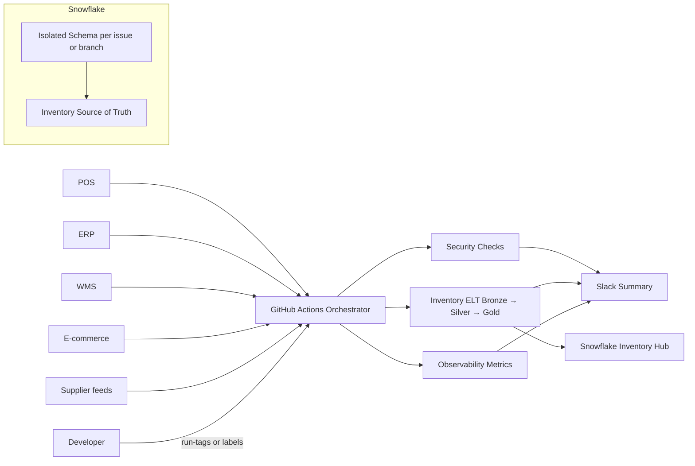
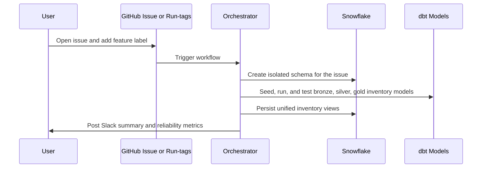

# Real-Time Inventory Visibility — Hands-on DataOps Lab

This repo shows how to keep inventory truth fresh across POS, ERP, WMS, e-commerce, and supplier feeds using Snowflake, dbt, and GitHub Actions. It is written for junior Analytics Engineers, Data Engineers, and Data Scientists: every step is explicit, no prior DataOps experience required.

## Why this repo
- **Problem**: Inventory drifts when feeds are late, missing, or inconsistent (SKUs, locations, timestamps). That causes oversells, stockouts, and confused customers.
- **Goal**: Give you a repeatable blueprint to ingest feeds, normalize inventory, and monitor freshness so you spot issues before they hit dashboards or APIs.
- **Approach**: Automated pipelines with clear gates: Security → ELT → Observability. Each run uses an isolated Snowflake schema so experiments are safe and easy to clean up.

## Use case: Real-Time Inventory Visibility Across All Channels
**DataOps role**
- Automate ingestion of POS, ERP, WMS, e-commerce, and supplier feeds using robust pipelines (batch today, streaming-ready patterns for later).
- Normalize SKUs, locations, timestamps, and stock metrics into a single source of truth.
- Monitor pipeline reliability to avoid stale or missing stock data before it reaches consumers.

**Value**
- Accurate stock levels in real time across warehouses, stores, and digital channels.
- Reduced stockouts and overselling, especially in multi-warehouse and omnichannel setups.
- Faster onboarding and rollback of feeds with isolated schemas and cleanup paths.

## Who this is for
- **Analytics Engineer**: wants dbt patterns for bronze/silver/gold and quality tests.
- **Data Engineer**: wants CI/CD hooks, environment isolation, and secrets handled correctly.
- **Data Scientist**: wants reliable, documented data they can explore without worrying about broken feeds.

## What you will build
- A **single source of truth** for inventory that blends POS, ERP, WMS, e-commerce carts, and supplier stock feeds.
- **Real-time aware ELT**: batch-friendly today, streaming-ready patterns for later.
- **Reliability signals**: freshness, row volume, failure, and duration metrics pushed to Slack.
- **Safe sandboxes**: issue labels or run-tags create isolated schemas; cleanup is automated.

## Architecture at a glance


## Pipeline journey (issue-driven)


## Tools and why they are here
- **GitHub Actions**: Orchestrates Security → ELT → Observability with opt-in run-tags and issue labels. Produces logs and Slack summaries.
- **Snowflake**: Central warehouse; each run writes to an isolated schema to avoid collisions.
- **dbt**: Implements medallion modeling and tests for SKUs, locations, and stock metrics.
- **Python utilities**: Create/drop schemas, generate seeds, and run metrics queries.
- **Slack webhooks**: Human-friendly notifications so you see stage results and reliability signals.
- **Policy configs**: `.sqlfluff`, `.yamllint.yml`, `.pre-commit-config.yaml` enforce SQL and YAML quality locally and in CI.

## Security and quality gates (what to expect)
- **Security SAST**: SQLFluff linting on changed SQL. Outputs SARIF, annotates PRs, fails fast on violations.
- **ELT stages**:
  - Bronze: Seeds and loads raw POS/ERP/WMS/e-comm/supplier data.
  - Silver: Conforms SKUs, locations, timestamps, and stock metrics.
  - Gold: Publishes availability KPIs (on-hand, available-to-promise, safety stock drift).
  - dbt run/test results are visible in logs; failures stop downstream jobs.
- **Observability**: Collects freshness, row counts, failures, duration per environment. Publishes to Slack when configured.
- **Orchestrator summary**: Final Slack message with stage outcomes and run URL when `SLACK_WEBHOOK_URL` is set.

## Repository map
- `.github/workflows`: Orchestrator plus stage workflows (security, ELT, observability).
- `scripts/dbt`: dbt project (models, seeds, macros, profiles).
- `scripts/python`: Helpers for seeding, metrics, and schema management.
- `scripts/sql`: SQL for metrics and utilities.

## Prerequisites
- A Snowflake account with a role and warehouse you can use.
- A GitHub repo with Actions enabled.
- Secrets set in GitHub → Settings → Secrets and variables → Actions:
  - `SNOWFLAKE_ACCOUNT`, `SNOWFLAKE_USER`, `SNOWFLAKE_PASSWORD`, `SNOWFLAKE_ROLE`, `SNOWFLAKE_WAREHOUSE`, `SNOWFLAKE_DATABASE`
  - `OBSERVABILITY_SCHEMA_PREFIX`
  - `SLACK_WEBHOOK_URL` (optional but recommended)
- Repo labels (create once):
  - `feature` (triggers provisioning + pipelines)
  - `cleanup` (triggers teardown)
  - Create via GitHub UI or, if `gh` is installed:
    ```bash
    gh label create feature --color C2F5FF --description "Run pipelines for inventory feature"
    gh label create cleanup --color FFE6E6 --description "Cleanup provisioned schema/object"
    ```

## Setup (local optional, CI required secrets only)
1) Clone the repo.
2) Set the secrets above in GitHub.
3) Optional local install:
   ```bash
   python -m venv .venv && source .venv/bin/activate
   pip install -r scripts/python/elt.req.txt
   ```

## How to run a demo from a branch (quick start)
1) Start from main:
   ```bash
   git checkout main
   git pull
   ```
2) Create a feature branch:
   ```bash
   git checkout -b feature/inventory-visibility
   ```
3) Push a tiny change with run-tags to kick off the pipeline:
   ```bash
   echo "# inventory demo touch" >> demo.txt
   git add demo.txt
   git commit -m "Demo inventory run #orchestrate #run_elt #run_obs"
   git push -u origin feature/inventory-visibility
   ```

**Expected outputs**:
- Security job runs SQLFluff on changed SQL and should pass if no lint issues.
- ELT jobs seed and run dbt models; dbt test results show in logs.
- Observability job reports metrics and, if `SLACK_WEBHOOK_URL` is set, posts a Slack summary.
- Orchestrator summary links to the run and shows stage outcomes.

## How to onboard a new feed via issue (no code needed)
1) Ensure the `feature` label exists (see prerequisites). In the GitHub web UI, open an issue, add the `feature` label, and describe the feed and schema/object name (e.g., `inv_supplier_stage`). Adding the label (not just opening the issue) is what triggers the orchestrator.
   - If the issue was created without the label, simply add the `feature` label afterward; the workflow listens to the label event.
   - If you prefer CLI and have `gh` installed (and the label exists):
     - Create and label in one shot:
       ```bash
       gh issue create \
         --title "Feature – onboard new supplier feed" \
         --label feature \
         --body $'Schema/Object Name: inv_supplier_stage\nUse case: Normalize supplier stock feed and stitch to WMS/POS inventory.'
       ```
     - Or label an existing issue to trigger the workflow:
       ```bash
       gh issue edit <issue_number> --add-label feature
       ```
2) The orchestrator will:
   - Create an isolated schema like `inv_supplier_stage_issue_<issue_id>` in Snowflake.
   - Run Security → ELT → Observability.
   - Post Slack summary (if webhook set).

## Cleanup
- Add a `cleanup` label to an issue (or use the cleanup issue template) to drop the isolated schema created for that issue.

## Troubleshooting
- **No pipeline on push**: Ensure your commit message has a run-tag (`#orchestrate`, `#run_elt`, `#run_obs`, `#run_all`).
- **Missing secrets**: Workflows fail fast with explicit error messages; verify GitHub Action secrets.
- **Snowflake auth errors**: Check role/warehouse/database names and credentials.
- **SQL lint failures**: Follow SQLFluff guidance in the Action logs and re-run.

## Next steps
- Extend bronze seeds to include your own POS/ERP/WMS extracts.
- Add dbt tests for SKU/location conformance specific to your business rules.
- Wire Slack to a channel the team watches so reliability signals are visible.
